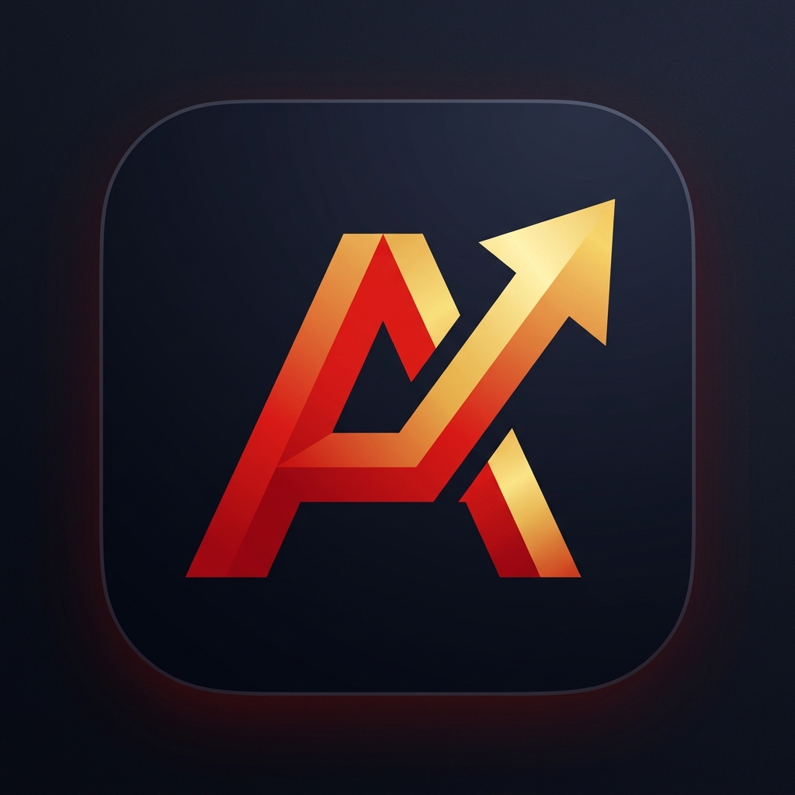

# 📈 BIGA 机构级公募基金量化投研与资产配置工作站

<p align="center">
  
</p>

<p align="center">
  <b>面向专业投资者与量化研究员的 Windows 桌面级公募基金全景量化分析、投资组合优化与 AI 模拟操盘系统</b>
</p>

<p align="center">
  
  
  
  
  
  
</p>

---

## 🌟 核心特性概览

BIGA 是一套完全基于 **.NET 8 WPF** 构建的现代暗黑风格机构级公募基金量化投研平台。系统内置高性能 **DuckDB 列式时序数据库**，深度融合经典现代投资组合理论（MPT）、Brinson 业绩归因、Barra 风险模型、Fama-French 五因子资产定价与 AI 模拟操盘推演引擎。

```
BIGA 工作台架构
├── 📈 单基量化分析 (13 维深度量化投研看板)
├── 🤖 AI 模拟操盘 (10 万模拟金实战演练与时序收益追踪)
├── 🔍 多维选基工作台 (全市场 1.8 万只基金多因子漏斗严选)
├── 🥊 基金多维对比 PK (双基/多基同台量化雷达擂台)
├── 🧩 组合资产配置工作站 (有效前沿 / 风险平价 / 蒙特卡洛推演)
├── 🧮 快速复利定投计算器 (自适应均线择时倍投与止盈回测)
└── ⚙️ 系统首选项与 DuckDB 数据引擎 (列式存储 / 离线加速)
```

---

## 🚀 核心功能模块

### 1. 🤖 AI 模拟操盘实战中心 (Paper Trading)
- **10 万元初始模拟现金**：自动分配 100,000 元流动金，数据落地 DuckDB 本地持久化存储，支持随时一键重置。
- **AI 多条件智能分析建仓**：
  - 基于 **4433 机构严选法则**、**五维量化综合得分**、**科学投决建议信号** 与 **核心-卫星资产配置架构**；
  - 提供 **🏆 均衡全天候型（推荐）**、**🚀 进取成长先锋型**、**🛡️ 绝对收益防守型** 三大方案，支持一键下单自动购入。
- **完全自由交互操作**：
  - **自由买入**：支持搜索任意基金代码，支持快捷比例（¥10,000 / 25%现金 / 50%现金 / 全额）与自定义金额，自动扣减 0.10% 申购费与核算持仓；
  - **自由卖出/赎回**：支持按份额或比例（25%、50%、75%、全部清仓）卖出，结算实现平仓盈亏与赎回费，资金即时回笼；
  - **持仓 AI 实时诊断**：浮盈超过 15% 且短期 RSI 超买触发分批止盈建议；趋势破位触发止损换基建议；
  - **快捷联动**：单基分析看板支持一键 `[🎯 模拟买入]`，将正在研判的标的直接带入模拟盘。
- **长周期收益观察与沪深 300 基准对标**：
  - 基于 ScottPlot 交互曲线重构自建仓以来的 **每日总资产与累计收益率走势图**；
  - 同期叠加 **沪深 300 基准指数曲线**，全景展现相对超额收益 Alpha；
  - 实时统计年化收益率、历史最大回撤、夏普比率、卡玛比率与交易胜率。

### 2. 📈 单基量化分析深度看板
- **基础全景**：全市场公募基金实时联想搜索、盘中实时估算净值、晨星九宫格风格箱定位。
- **13 大专业量化投研维度**：
  1. **📊 核心风控指标**：年化收益率、年化波动率、夏普比率、最大回撤、卡玛比率、索提诺比率、信息比率、95% 历史模拟法 VaR / CVaR。
  2. **🏆 五维量化评价**：收益能力、抗风险能力、收益稳定性、选股择时能力、性价比雷达评分。
  3. **📦 季报重仓与行业**：穿透前十大重仓股持仓明细、大类资产配置比例时序变动（股票/债券/现金）。
  4. **🎯 Brinson 业绩归因**：单期与多期资产配置效应（Allocation）、个股选择效应（Selection）与交互效应（Interaction）。
  5. **🧭 风格漂移监控**：基于滚动多因子回归监测基金经理风格稳定性。
  6. **📉 深度回撤解构**：水下回撤曲线、历史最大回撤区间及其修复时长分析。
  7. **🧬 Barra 风格归因**：规模因子（Size）、价值因子（Value）、动量因子（Momentum）、波动率因子（Volatility）等系统性风险暴露暴露度分析。
  8. **👔 经理生涯与胜率**：基金经理从业年限、管理规模、任职回报、牛熊捕获率（Upside/Downside Capture Spread）。
  9. **🏛️ FF5 资产定价模型**：Fama-French 五因子回归检验超额阿尔法显著性。
  10. **🎲 运气 vs 技能审计**：基于 Bootstrap 检验与重抽样算法，剔除市场β与运气成分，甄别基金经理纯真阿尔法技能。
  11. **🚀 科学投决与前瞻研判**：短中期多周期协同矩阵，提供 StrongBuy（强烈增配）、Accumulate（逢低定投）、Hold（继续持有）、TrimProfit（逢高止盈）、StopLossExit（破位止损）权威信号。
  12. **🏆 4433 与因子效力**：4433 机构选基严选体检、阿尔法持续性检验与因子 IC/IR 效力。
  13. **🤖 AI 模拟操盘**：标的实时模拟操盘面板与一键直通工作台。

### 3. 🧩 组合资产配置工作站
- **现代投资组合理论（MPT）**：马科维茨有效前沿（Efficient Frontier）蒙特卡洛随机漫步模拟推演。
- **量化优化模型库**：
  - 最大夏普比率组合（Max Sharpe）；
  - 最小方差组合（Min Variance）；
  - 风险平价组合（Risk Parity）；
  - 机器学习层次风险平价（HRP - Hierarchical Risk Parity）；
  - Black-Litterman 贝叶斯观点配置模型；
  - 均值-CVaR 极值尾部损失优化；
  - Choueifaty 最大分散化投资组合（MDP）。
- **组合穿透与压力测试**：组合底层持仓重叠度穿透分析、极端黑天鹅宏观压力测试（流动性枯竭、利率急升、权益暴跌等）。

### 4. 🔍 多维选基与对比 PK 擂台
- **选基漏斗**：覆盖全市场近 1.8 万只公募基金，支持按板块赛道（宽基、科技AI、红利价值、医药消费、固收债基）以及量化指标组合过滤；
- **双基/多基 PK**：多只标的历史净值收益率走势叠加对齐、量化风控指标同台对决、两两相关系数矩阵热力图展示。

---

## 🛠️ 技术栈架构

| 模块 | 技术选型 | 说明 |
| :--- | :--- | :--- |
| **运行时** | .NET 8.0 (C# 12) | Windows Presentation Foundation (WPF) |
| **架构模式** | MVVM (Model-View-ViewModel) | `CommunityToolkit.Mvvm` (代码生成器与强类型属性/命令) |
| **存储引擎** | DuckDB (`DuckDB.NET.Data.Full`) | 高性能嵌入式列式数据库，支持大规模高频时序与聚合秒查 |
| **数据可视化**| ScottPlot 5 (`ScottPlot.WPF`) | 高性能平滑交互图表，支持百万级时序数据点丝滑缩放与拖拽 |
| **测试框架** | MSTest | 涵盖 383 项单元测试用例，覆盖全量量化模型与交易逻辑 |

---

## 💻 快速开始

### 方式一：直接运行已编译包
项目根目录提供了便携式免安装版本：
```
d:\Projects\Biga\publish\BIGA.exe
```
双击 `BIGA.exe` 即可直接启动运行。

### 方式二：从源码编译构建

#### 环境要求
- Windows 10 / 11 (x64)
- [.NET 8.0 SDK](https://dotnet.microsoft.com/download/dotnet/8.0)
- Visual Studio 2022 (推荐) 或 VS Code + C# Dev Kit

#### 构建步骤
```powershell
# 1. 克隆代码仓库
git clone https://github.com/halfdolor/BIGA.git
cd BIGA

# 2. 还原 NuGet 依赖并编译
dotnet build

# 3. 运行全部单元测试 (383项测试)
dotnet test

# 4. 发布可执行程序
dotnet publish src/BigaFund/BigaFund.csproj -c Release -o publish
```

---

## ⌨️ 常用快捷键

| 快捷键 | 功能操作 |
| :--- | :--- |
| **`Ctrl + E`** / **`Ctrl + 7`** | **切换至 🤖 AI 模拟操盘工作台** |
| **`Ctrl + 1`** | 切换至 📈 单基量化分析工作台 |
| **`Ctrl + 2`** | 切换至 🔍 多维选基工作台 |
| **`Ctrl + 3`** | 切换至 🥊 基金多维对比 PK |
| **`Ctrl + 4`** | 切换至 🧩 组合资产配置工作站 |
| **`Ctrl + 5`** | 切换至 🧮 快速复利定投计算器 |
| **`Ctrl + 6`** / **`Ctrl + ,`** | 切换至 ⚙️ 系统首选项与参数设置 |
| **`Ctrl + D`** | 将当前分析基金加入 / 移出用户自选池 |
| **`Ctrl + M`** | 快速进入组合配置与回测 |
| **`Ctrl + F`** | 快速打开全市场选基大厅 |
| **`F5`** | 强制刷新当前基金最新净值时序 |

---

## 📄 开源许可证

本项目基于 [MIT License](LICENSE) 协议开源。
仅供学术研究、个人量化分析与模拟演练使用，不构成任何实质性投资决策建议。
